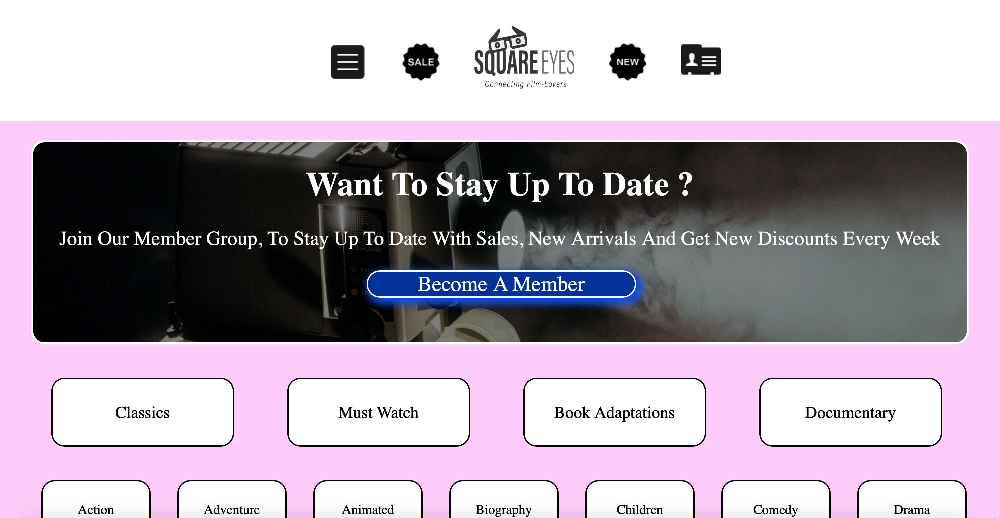
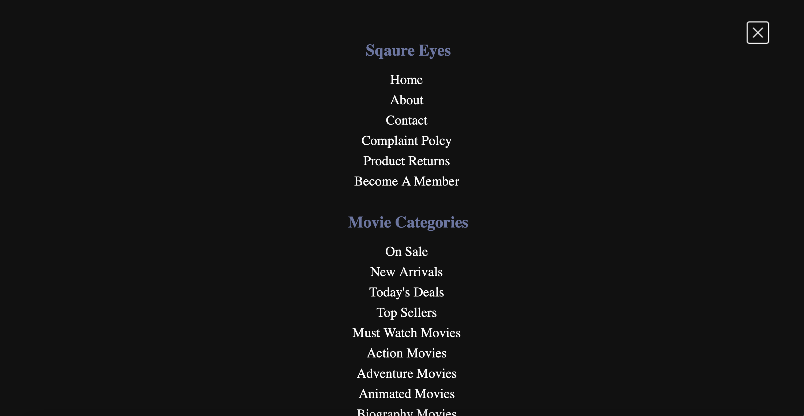
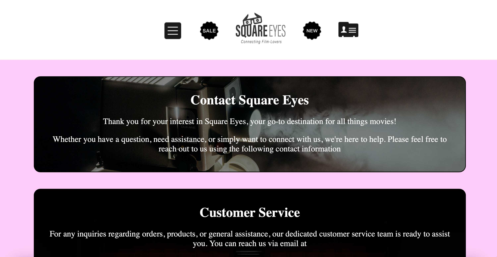
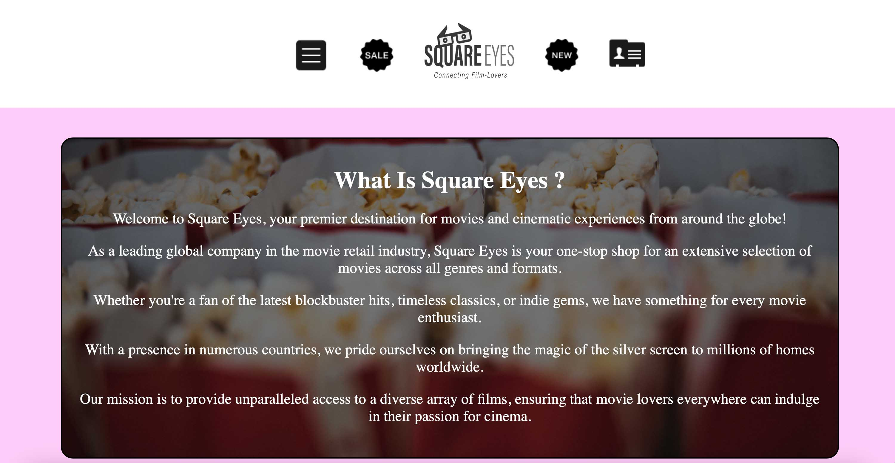
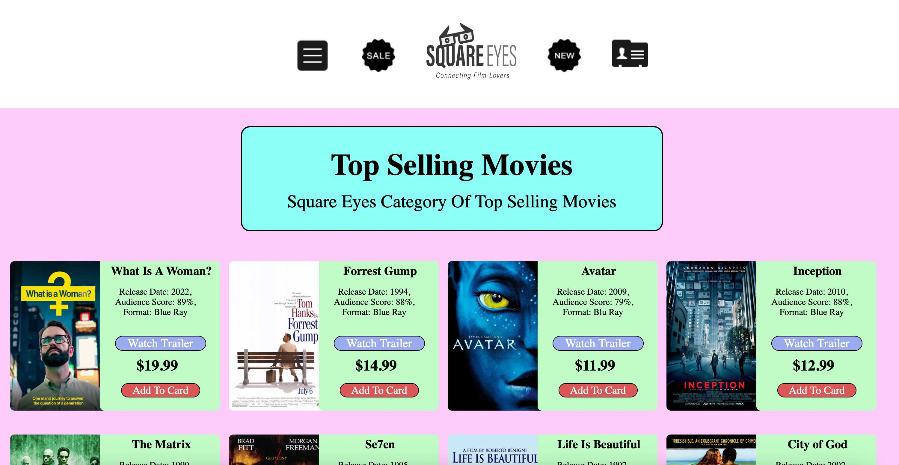
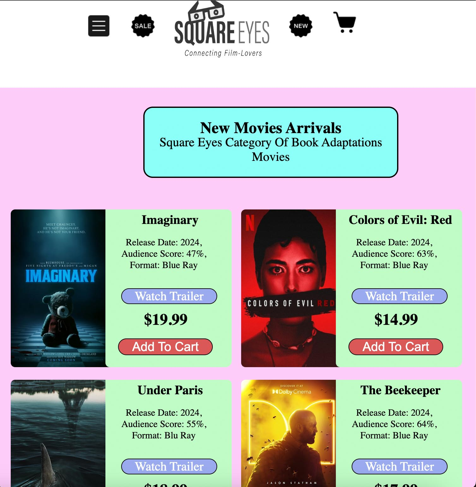
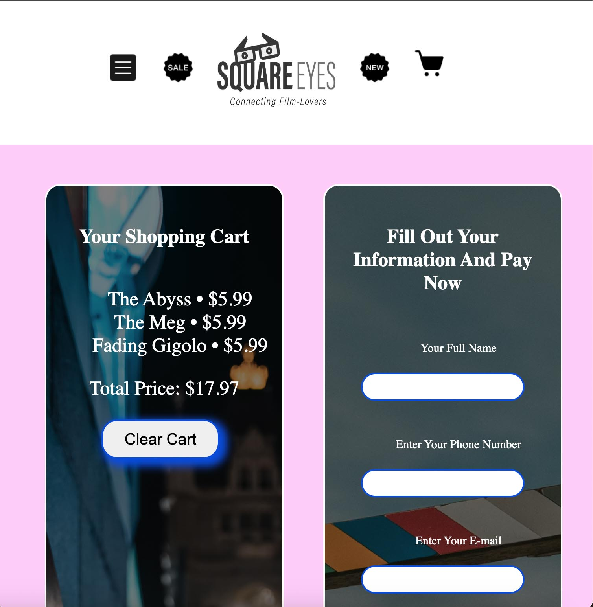
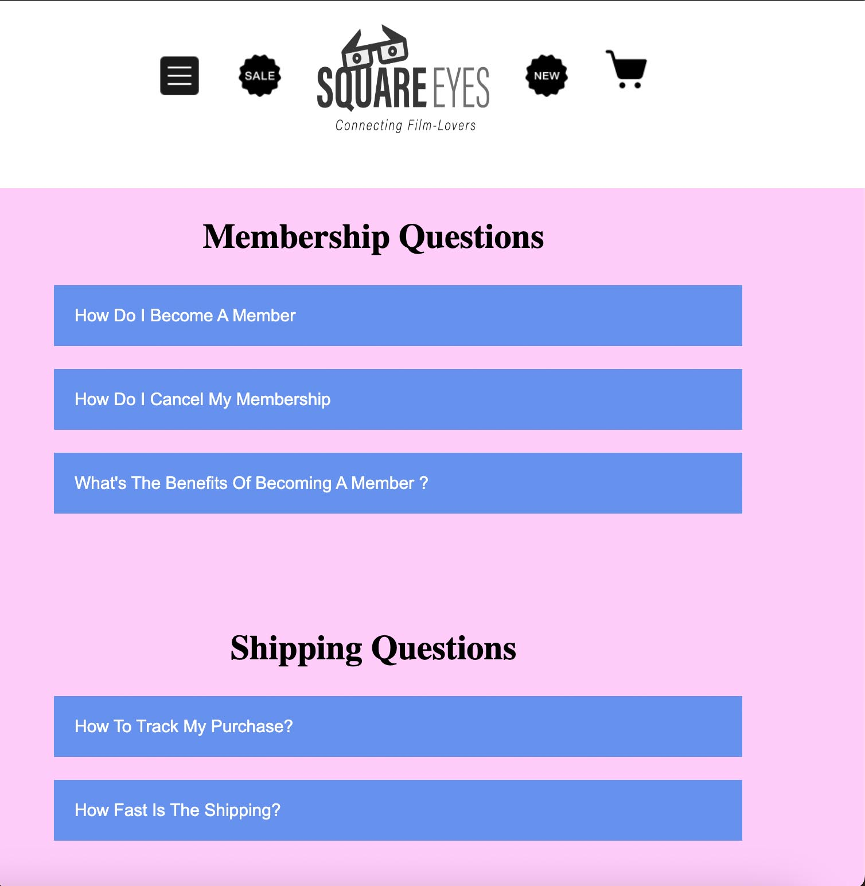
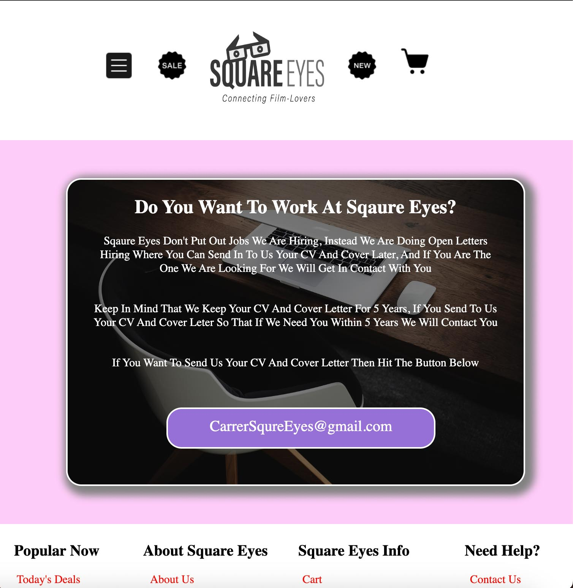

# Square-Eyes-Project
[GitHub Pages Link](https://darthcoursucant.github.io/Square-Eyes-Project/)

## Created With
    - HTML 
    - CSS  
    - JavaScript
    - Figma 
    - VS Code
    - Github & Github Pages

## Pictures / Icon / Fonts / Content From 
    - Icon8
    - Unsplash
    - Google Fonts
    - ChatGPT

## What Is Sqaure Eyes Project ? 
- Sqaure Eyes Project is a project assingnemnt I had in my first semester at Noroff Bergen.
- Is A DVD selling company fully based on the internett. It offers you a "membership" option where you get discounts on your purchases and you get discounts for movie viewings in theaters and events like Comicon.

## How Does Sqaure Eyes Look Like For Desktop / Laptop Size Devices ?
### Home Page On Desktop / Laptop

### Menu On Desktop / Laptop

### Contact Page On Desktop / Laptop

### About Page On Desktop / Laptop

### Top Sellers Page On Desktop / Laptop

## How Does Sqaure Eyes Look Like For Phone size Devices ?
### Home Page On Phone

### New Arrrivals Page On Phone

### Cart Page On Phone

### FAQ Page On Phone

### Carrer Page On Phone
